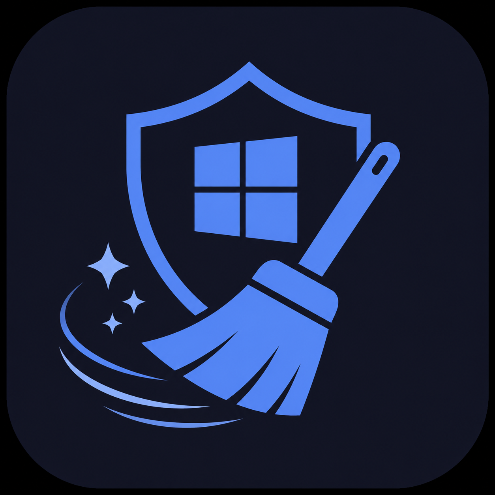

<div align="center">



# 🧹 Windows Cache Cleaner

**A modern, zero-dependency Windows system cleaner with a polished neon dark UI**

[](LICENSE)
[](../../releases/latest)
[](https://dotnet.microsoft.com/)
[](../../releases/latest)
[](../../releases/latest)

---

## ⬇️ Download

<table>
<tr>
<td align="center" width="50%">

### 🖥️ GUI Application

<a href="../../releases/latest/download/WinCacheCleaner.exe">
  
</a>

**Double-click to run · No install needed · ~35 KB**
<br/>
Requires Windows 10/11 · UAC elevation auto-prompted

</td>
<td align="center" width="50%">

### 📜 Batch Script

<a href="cleaner.bat">
  
</a>

**Right-click → Run as Administrator**
<br/>
No dependencies · Works on any Windows version

</td>
</tr>
</table>

> **Note:** Both tools require **Administrator** privileges. The `.exe` auto-prompts via UAC. The `.bat` must be right-clicked → _Run as administrator_.

</div>

---

## ✨ Features

| Feature | Details |
|---------|---------|
| 🎨 **Modern Neon UI** | Custom dark WPF window — gradient borders, neon glow, no standard chrome |
| ☑️ **Per-task checkboxes** | Enable or disable each cleanup task individually |
| 📊 **Size reporting** | Measures and reports MB/GB freed per task + grand total |
| ⚡ **Non-blocking** | Runs cleanup on a background thread — UI stays responsive |
| 🌙 **Dark / Light toggle** | Switch themes live at runtime |
| 🛡️ **UAC auto-elevation** | Manifest-enforced admin — no workarounds |
| 📦 **Zero dependencies** | .NET Framework 4.8 ships pre-installed on Windows 10/11 — nothing to install |
| 🪶 **Tiny footprint** | ~35 KB executable |

---

## 🗑️ What It Cleans

### Original Tasks
| # | Task | Location |
|---|------|----------|
| 1 | 🌡️ User Temp | `%TEMP%` |
| 2 | 🌡️ Windows Temp | `C:\Windows\Temp` |
| 3 | ⚡ Prefetch | `C:\Windows\Prefetch` |
| 4 | 📦 SoftwareDist Cache | `C:\Windows\SoftwareDistribution\Download` |
| 5 | 🗑️ Recycle Bin | All drives |
| 6 | 🌐 DNS Cache | Flush resolver cache |
| 7 | 🖼️ Thumbnail Cache | `thumbcache_*` in Explorer folder |
| 8 | 📋 Recent Files | Windows Recent items list |
| 9 | 🎮 DirectX Shader Cache | `%LocalAppData%\D3DSCache` |

### Extended Safe Tasks
| # | Task | Location |
|---|------|----------|
| 10 | 💥 Windows Error Reports | `WER\ReportArchive` + `ReportQueue` |
| 11 | 🧠 Memory Dumps | `C:\Windows\Minidump` + `CrashDumps` |
| 12 | 📋 CBS Logs | `C:\Windows\Logs\CBS` |
| 13 | 🔧 DISM Logs | `C:\Windows\Logs\DISM` |
| 14 | 📡 Delivery Optimization | Windows Update peer cache |
| 15 | 🖼️ Icon Cache | `iconcache_*` in Explorer folder |
| 16 | 🧹 Disk Cleanup | Windows built-in `cleanmgr` |

---

## 🖥️ Screenshots

<div align="center">

> _Dark neon theme with gradient border ring, per-task checkboxes, live log, and neon RUN CLEANUP button_

</div>

---

## 🔒 Safety & Security

This tool was **developed carefully under guided best-practice instructions** with the following guarantees:

- ✅ **No over-deletion** — target paths are hardcoded to match only known safe cache locations. Nothing user-typed is ever executed as a path.
- ✅ **Per-file error handling** — locked or in-use files are silently skipped (mirrors Windows' own `del /f` behaviour). No crashes on partial failures.
- ✅ **Admin enforced via manifest** — `requireAdministrator` in `app.manifest` means the OS enforces elevation before the app even starts. No self-privilege-escalation tricks.
- ✅ **No network calls** — fully offline. No telemetry, no analytics, no outbound connections.
- ✅ **No registry writes** — does not touch the registry (except `cleanmgr /sagerun:1` which is a standard Windows utility).
- ✅ **Open source** — full source code is available for audit. MIT licensed.
- ✅ **Skips risky locations** — `C:\Windows\Installer`, `C:\Windows\System32`, Windows Search Index, and MSOCache are intentionally excluded.

> **Developed under AI-assisted code review** with explicit attention to OWASP safety principles, safe file deletion patterns, and Windows security best practices.

---

## 🏗️ Build from Source

**Requirements:** Windows 10/11 · .NET 8 SDK or Visual Studio 2022

```bash
# Clone
git clone https://github.com/Dark-in-Star/win-cache-cleaner.git
cd win-cache-cleaner

# Build Release
dotnet build WinCacheCleaner.csproj -c Release

# Output
bin\Release\net48\WinCacheCleaner.exe
```

**Project structure:**
```
win-cache-cleaner/
├── WinCacheCleaner.csproj     # SDK-style project (net48, WPF)
├── app.manifest               # requireAdministrator UAC
├── App.xaml / App.xaml.cs
├── MainWindow.xaml            # Full neon dark UI
├── MainWindow.xaml.cs         # Async cleanup logic
├── Models/                    # CleanupTask, LogEntry, TaskResult
├── Services/                  # CleanerService, RecycleBinHelper, SizeFormatter
├── ViewModels/                # MainViewModel (MVVM binding)
├── Themes/                    # Dark.xaml, Light.xaml
├── cleaner.bat                # Standalone batch fallback
├── icon.ico                   # App icon (Explorer / taskbar)
└── icon.png                   # App icon (window title bar)
```

---

## 📄 License

```
MIT License — Copyright (c) 2026 Dark-in-Star
```

This project is open source under the [MIT License](LICENSE).  
Free to use, modify, and distribute — attribution appreciated.

---

<div align="center">

Made with ❤️ by [Dark-in-Star](https://github.com/Dark-in-Star)

[](LICENSE)
[](../../stargazers)

</div>
